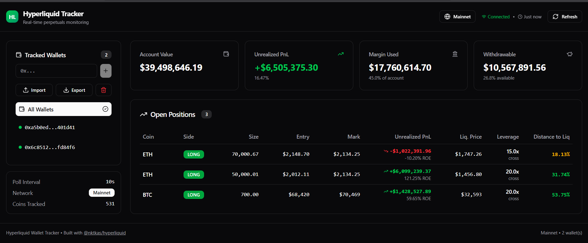

# Hyperliquid Wallet Tracker

A modern, real-time wallet tracker dashboard for Hyperliquid perpetuals. Built with Next.js 15, TypeScript, and the [@nktkas/hyperliquid](https://github.com/nktkas/hyperliquid) SDK.



## Features

- **Multi-wallet tracking** - Track multiple public wallet addresses simultaneously
- **Real-time polling** - Configurable polling interval (default: 10 seconds)
- **Account summary** - View account value, unrealized PnL, margin used, withdrawable
- **Position tracking** - See all open positions with entry/mark price, leverage, PnL
- **Liquidation monitoring** - Distance to liquidation with color-coded warnings
- **Change detection** - Toast notifications for new/closed positions and PnL swings
- **Network toggle** - Switch between mainnet and testnet
- **Dark mode** - Beautiful dark theme by default
- **Responsive design** - Works on desktop, tablet, and mobile

## Tech Stack

- [Next.js 15+](https://nextjs.org/) (App Router, React 19)
- [TypeScript](https://www.typescriptlang.org/) (strict mode)
- [@nktkas/hyperliquid](https://github.com/nktkas/hyperliquid) SDK
- [Tailwind CSS v4](https://tailwindcss.com/)
- [shadcn/ui](https://ui.shadcn.com/) components
- [Sonner](https://sonner.emilkowal.ski/) for toast notifications
- [Lucide React](https://lucide.dev/) for icons

## Getting Started

### Prerequisites

- Node.js 18.18 or later
- npm, pnpm, yarn, or bun

### Installation

1. **Clone the repository**

```bash
git clone <your-repo-url>
cd hyperliquid-wallet-tracker
```

2. **Install dependencies**

```bash
npm install
# or
pnpm install
# or
yarn install
# or
bun install
```

3. **Optional: Set default config in JSON**

Edit `data/config.json` if you want initial defaults:

```json
{
  "wallets": [],
  "settings": {
    "pollInterval": 10000,
    "isTestnet": false
  }
}
```

Runtime changes are persisted automatically to browser `localStorage`.

4. **Run the development server**

```bash
npm run dev
# or
pnpm dev
# or
yarn dev
# or
bun dev
```

5. **Open your browser**

Navigate to [http://localhost:3000](http://localhost:3000)

## Configuration

### Configuration Storage

- **Source of truth:** Browser `localStorage`
- **Default fallback:** `data/config.json`
- **Import/Export:** JSON file from the sidebar

### Adding Wallets

You can manage wallets in three ways:

1. **Via UI** - Add/remove wallets from the sidebar
2. **Import JSON** - Import wallet list from file
3. **Export JSON** - Export current wallet list for backup/share

## MCP Server

This project now includes an MCP server so AI clients (Cursor, Claude Desktop, Claude Code, etc.) can call Hyperliquid wallet tools directly.

### Run MCP server

```bash
npm run mcp:start
```

### Available MCP tools

- `list_tracked_wallets`
- `add_wallet`
- `remove_wallet`
- `clear_wallets`
- `get_all_mids`
- `get_account_summary`
- `get_wallet_positions`
- `get_multi_wallet_summary`

### Available MCP resources

- `hyperliquid://config`
- `hyperliquid://status`

### MCP client config

Use `mcp.json` as a reference. Example:

```json
{
  "mcpServers": {
    "hyperliquid-tracker": {
      "command": "npm",
      "args": ["run", "mcp:start"],
      "cwd": "/absolute/path/to/hyperliquid-tracker"
    }
  }
}
```

or

```json
{
  "mcpServers": {
    "hyperliquid-tracker": {
      "command": ["npx", "tsx", "/absolute/path/to/hyperliquid-tracker/mcp/server.ts"],
    }
  }
}
```

## Project Structure

```
hyperliquid-wallet-tracker/
├── mcp/
│   ├── server.ts                 # MCP stdio server
│   └── config-store.ts           # JSON config read/write for MCP
├── mcp.json                      # MCP client config example
├── app/
│   ├── globals.css        # Global styles + Tailwind
│   ├── layout.tsx         # Root layout
│   └── page.tsx           # Dashboard page
├── components/
│   ├── dashboard/
│   │   ├── AccountSkeleton.tsx   # Loading skeleton
│   │   ├── PositionTable.tsx     # Positions table
│   │   ├── SummaryCards.tsx      # Account summary cards
│   │   ├── WalletDashboard.tsx   # Main dashboard component
│   │   └── WalletSelector.tsx    # Wallet picker
│   ├── providers/
│   │   └── ToastProvider.tsx     # Toast notifications
│   └── ui/                       # shadcn/ui components
├── hooks/
│   └── useWalletPolling.ts       # Polling hook with change detection
├── lib/
│   ├── hyperliquid.ts            # SDK client + data fetching
│   ├── types.ts                  # TypeScript type definitions
│   └── utils.ts                  # Utility functions
├── data/
│   └── config.json               # Default config (wallets + settings)
├── components.json               # shadcn/ui config
├── next.config.ts
├── package.json
├── tailwind.config.ts
└── tsconfig.json
```

## Key Components

### `useWalletPolling` Hook

Custom hook that handles:
- Periodic data fetching from Hyperliquid API
- Parallel fetching of multiple wallets
- Change detection between polls
- Toast notifications for significant changes

### Data Flow

```
useWalletPolling
  ├── fetchWalletsData()
  │     ├── InfoClient.allMids()        # Get all mid prices
  │     └── InfoClient.clearinghouseState() # Per wallet
  ├── processClearinghouseState()        # Transform SDK response
  ├── detectChanges()                    # Compare with previous state
  └── notifyChanges()                    # Show toast notifications
```

## API Reference

This project uses the public Info API endpoints from Hyperliquid:

- `POST /info` with `type: "clearinghouseState"` - Get account summary and positions
- `POST /info` with `type: "allMids"` - Get current mid prices for all coins

See [@nktkas/hyperliquid documentation](https://nktkas.gitbook.io/hyperliquid/) for more details.

## Liquidation Distance Calculation

The dashboard calculates distance to liquidation as a percentage:

```typescript
// For LONG positions: ((markPrice - liqPrice) / markPrice) * 100
// For SHORT positions: ((liqPrice - markPrice) / markPrice) * 100
```

Color coding:
- 🔴 Red (danger): < 10%
- 🟡 Yellow (warning): 10-20%
- 🟢 Green (safe): > 20%

## Change Detection

The app detects and notifies for:
- **New positions** - Position opened in a coin
- **Closed positions** - Position closed
- **PnL swings** - PnL changed by >5% of margin used (and >$10)
- **Liquidation warnings** - Distance to liquidation dropped below 10%

## Building for Production

```bash
npm run build
npm start
```

## Type Checking

```bash
npm run typecheck
```

## Contributing

Contributions are welcome! Please feel free to submit a Pull Request.

## License

MIT License - feel free to use this project for any purpose.

## Acknowledgments

- [Hyperliquid](https://hyperliquid.xyz/) - The perpetuals DEX
- [@nktkas/hyperliquid](https://github.com/nktkas/hyperliquid) - Community TypeScript SDK
- [shadcn/ui](https://ui.shadcn.com/) - Beautiful UI components
- [Vercel](https://vercel.com/) - Next.js framework

---

**Note:** This is a read-only tracker. It does not require any private keys or signing capabilities. All data is fetched from public API endpoints.
